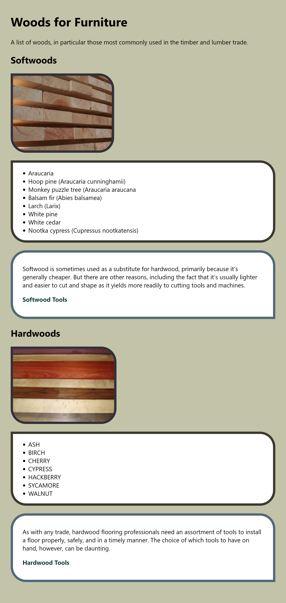
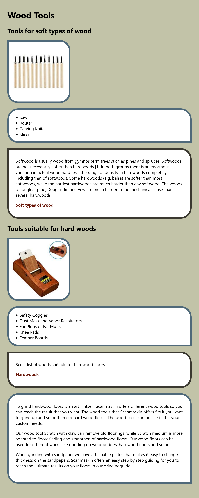

# speciwood

CSS Specificity Project

Work in groups of two.

Both html files load both CSS files, so everything you do can influence both documents, and you will need to make use of this as you will need to add styles for your partners document without changing his/her html code.

## Page About Wood types

### TODOs Team Member A

- Write the code to create the Woods page in woods.html
- Write CSS only in css/woodworking.css
- Add a border to the images
- Add border-radius to all edges but the top left one
- Your partner will have sections about Woods in his/her document. Make sure your border styles and link color are applied to those containers too.
- Make sure your styles work in your partners document no matter the order in which the CSS files are loaded
- Modify the links to your partners page so they scroll the page to the correct section

## Page about Wood Tools

### TODOs Team Member B

- <!-- Write the code to create the Tools page in tools.html -->
- Your partner will add borders to the content sections
- <!-- Write CSS only in css/tools.css -->
- There are sections about tools in your partners HTML. Use your CSS file to modify the borders of those sections: Set a different border color, add border radius in the top left corner and remove the border radius from the bottom right corner. Also set a different link color Dont overwrite any other styles your partner has set. Make sure your border styles are also applied to the tools sections in your partners document
- Make sure your styles work in your partners document no matter the order in which the CSS files are loaded
- Modify the links to your partners page so they scroll the page to the correct section
